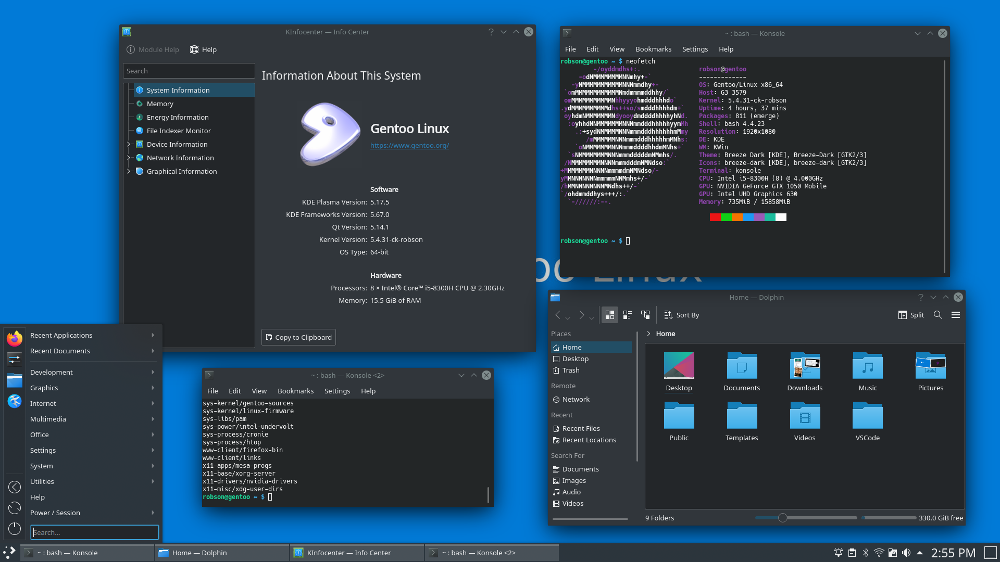

# Gentoo G3

[English]() | [Português]()

Installation, configuration and stage 4 for Gentoo Linux.



## Downloads

- [Minimal Desktop](https://androidfilehost.com/?fid=4349826312261786875) - Stage4
- [KDE/Plasma Desktop](https://androidfilehost.com/?fid=4349826312261786878) - Stage4

## Configurations

Portage

- [make.conf](./configurations/make.conf)
- [packages.use](./configurations/packages/use/)
- [packages.accept_keywords](./configurations/make.conf)

Kernel

- [Gentoo](./configurations/kernels/config.gentoo)
- [CK](./configurations/kernels/config.ck) _Updated!_

## Tutorial

### Intel undervolt

```bash
# /etc/intel-undervolt.conf

undervolt 0 'CPU' -125.0
undervolt 1 'GPU' 40.0
undervolt 2 'CPU Cache' -125.0
undervolt 3 'System Agent' -40.0
undervolt 4 'Analog I/O' 0
```

### SDDM

```bash
# /etc/sddm.conf

[Theme]
Current=breeze

CursorTheme=breeze_cursors

[X11]
DisplayCommand=/etc/sddm/scripts/Xsetup
---

# /etc/sddm/scripts/Xsetup

setxkbmap br-abnt2

xrandr --setprovideroutputsource modesetting NVIDIA-0
xrandr --auto
```

### NetworkManager

```bash
[main]
plugins=keyfile
hostname-mode=none
```

### Alsa/PulseAudio

```bash
# /etc/modprobe.d/alsa.conf

options snd cards_limit=2

options snd-hda-intel id=PCH index=0
options snd-hda-intel id=HDMI index=1

options snd-hda-intel model=headset-mic
```

### Libinput

```bash
# /etc/X11/xorg.conf.d/40-libinput.conf

Section "InputClass"
        Identifier "libinput touchpad catchall"
        MatchIsTouchpad "on"
        MatchDevicePath "/dev/input/event*"
        Option "Tapping" "True"
        Option "TappingDrag" "True"
        Driver "libinput"
EndSection
```

## Stage 4

### Minimal Desktop:

Profile:

```bash
default/linux/amd64/17.1/desktop/plasma
```

Kernel

```
linux-5.4.28-gentoo
```

### Plasma/KDE Desktop:

Profile:

```bash
default/linux/amd64/17.1/desktop/plasma
```

Kernel

```
linux-5.4.28-gentoo
```

Ebuilds:

```bash
app-admin/sudo
app-admin/sysklogd
app-misc/neofetch
app-portage/cpuid2cpuflags
app-portage/genlop
app-portage/gentoolkit
app-shells/bash-completion
dev-vcs/git
kde-apps/ark
kde-apps/gwenview
kde-apps/kate
kde-apps/kdecore-meta
kde-apps/okular
kde-apps/spectacle
kde-misc/latte-dock
kde-plasma/plasma-meta
media-fonts/liberation-fonts
media-libs/mesa
media-libs/nv-codec-headers
media-libs/vulkan-loader
media-plugins/alsa-plugins
media-sound/alsa-utils
media-video/ffmpeg
net-misc/aria2
net-misc/networkmanager
sys-apps/bleachbit
sys-apps/haveged
sys-apps/iucode_tool
sys-apps/lm-sensors
sys-apps/mlocate
sys-apps/pciutils
sys-apps/usbutils
sys-boot/grub:2
sys-firmware/intel-microcode
sys-fs/dosfstools
sys-fs/ntfs3g
sys-kernel/ck-sources
sys-kernel/gentoo-sources
sys-kernel/linux-firmware
sys-libs/pam
sys-power/intel-undervolt
sys-process/cronie
sys-process/htop
www-client/firefox-bin
www-client/links
x11-apps/mesa-progs
x11-base/xorg-server
x11-drivers/nvidia-drivers
x11-libs/libXScrnSaver # for Chromium based applications
x11-misc/xdg-user-dirs
```

OpenRC services:

```bash
Runlevel: default
 NetworkManager
 netmount
 xdm
 sysklogd
 haveged
 sshd
 bluetooth
 cronie
 intel-undervolt-loop
 local
Dynamic Runlevel: hotplugged
Dynamic Runlevel: needed/wanted
 xdm-setup
 dbus
Dynamic Runlevel: manual
```

## License
